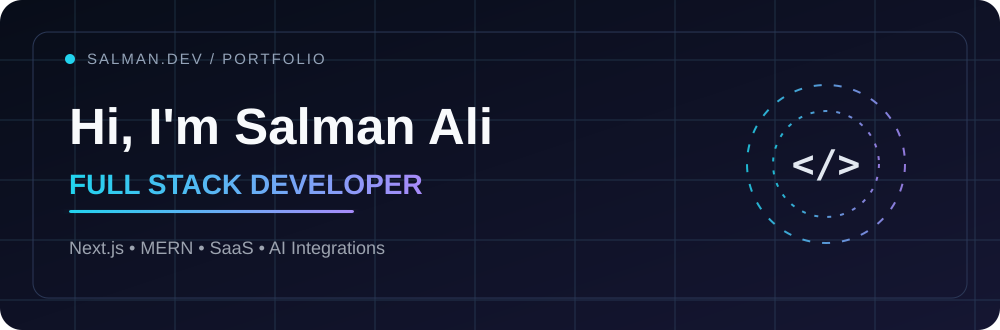

<picture>
  <source media="(prefers-reduced-motion: reduce)" srcset="./assets/banner-static.svg">
  
</picture>

  

### Full Stack Developer · Next.js · MERN · SaaS & AI Integrations

📍 Lahore, Pakistan &nbsp;·&nbsp; 🌍 Open to remote and on-site development opportunities

*Building useful products with thoughtful engineering, reliable systems, and modern interfaces.*

---

## ✦ About me

I'm a **full-stack developer** working across web applications, SaaS products, CRM platforms, AI integrations, and responsive user experiences. I work with **Next.js, React, TypeScript, Node.js, Express, MongoDB, PostgreSQL, and Prisma** to connect polished interfaces with reliable backend systems.

- **Frontend engineering:** Responsive websites, reusable UI systems, animations, accessibility, and performance.
- **Backend development:** REST APIs, authentication, role-based access control, and database architecture.
- **Product development:** Admin dashboards, CRM workflows, external APIs, and AI-enabled features.
- **Beyond the code:** Deployment, debugging, SEO, and maintainable engineering workflows.
- **Currently learning:** Cloud infrastructure, automation, and scalable application architecture.

## ⚡ Tech stack

**Frontend**

**Backend & databases**

**Tools & deployment**

## ◈ Selected projects

*A selection of professional and personal projects I have worked on. Source code and case studies are linked only where sharing is appropriate.*

| Project | Purpose | Stack |
|:--|:--|:--|
| **[REVEX](https://revexapp.com/)** | Crypto and AI product with wallet, market-data and chat integrations. | Next.js · TypeScript · Prisma · Web3 |
| **HBS CRM** | Lead management and follow-up workflows with role-based access and calling features. | React · Node.js · APIs |
| **[Hired Billing Support](https://hiredbillingsupport.com/)** | Healthcare revenue-cycle website, service pages, performance and SEO work. | React · UI Engineering · SEO |
| **HBS Dental** | Responsive dental billing and call-support web experiences. | Next.js · UI Engineering |
| **WorkdeskVA** | Remote staffing website with animated, responsive pages. | React · Bootstrap · GSAP |
| **GuardianX** | Parental-control and screen-time monitoring app prototype. | Flutter · Firebase · Android |
| **VoiceBoost AI** | AI-assisted text-to-speech and speech-to-text experience. | MERN · AI APIs |
| **BEA** | Frontend and backend contributions to a multi-feature platform. | Next.js · Node.js · Prisma |

<b>More technical interests</b>

 

Authentication & authorization · Database design · Third-party API integrations · Website migrations · Cloud deployment · Core Web Vitals · Technical SEO · Mobile applications · AI workflows.

## 📈 GitHub activity

  

<picture>
  <source media="(prefers-color-scheme: dark)" srcset="https://raw.githubusercontent.com/Salman1037/Salman1037/output/github-snake-dark.svg">
  
</picture>

The snake is generated by GitHub Actions from public contribution activity. If it is missing, run the workflow once.

## 🎓 Education & training

- **Computer Science studies** — Riphah International University / affiliated college program.
- **Full Stack Web Development** — PNY Training Institute.
- Additional hands-on work with modern web platforms, REST APIs, databases, and deployment.

## ✉️ Let's build something

Interested in collaborating on **SaaS platforms, CRM systems, AI-integrated products, or responsive web applications**?

  

Designed with intention · Built for the web · Always improving

